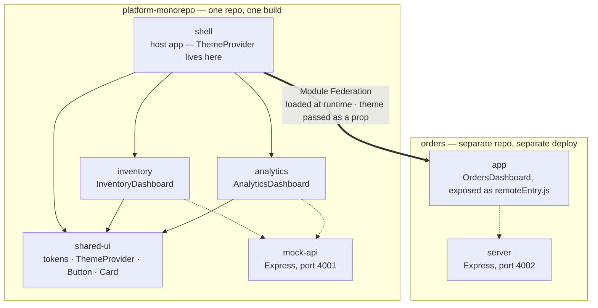

# platform-monorepo
Shell + Inventory + Analytics + shared design system — hosts Orders as a federated remote

A Yarn workspace monorepo housing a host application (`shell`), two
UI packages it statically bundles (`inventory`, `analytics`), a shared
design system (`shared-ui`), and a mock backend (`mock-api`).

This is one half of a two-repo demo. The other half —
[`orders`](https://github.com/aparajitwork/orders) — is a genuinely
separate micro-frontend, loaded into `shell` at runtime via Module
Federation. Everything in *this* repo is deliberately **not** federated.

## The core architectural decision this repo demonstrates

Not every piece of UI that could be called a "micro-frontend" needs Module
Federation. `inventory` and `analytics` live in this monorepo, get built
together with `shell`, and are consumed with a plain
`import { InventoryDashboard } from "@platform/inventory"` — no runtime
loading, no shared-dependency negotiation, no federation config at all.
Orders is the one exception, specifically because it's owned by a separate
team, in a separate repo, on a separate deploy schedule — the actual problem
Module Federation exists to solve. Reaching for federation everywhere
"because micro-frontends" would have been the less senior choice here, not
the more impressive one.

That split also produces two different, deliberately different theming
mechanisms, meeting at exactly one boundary:

- **`inventory` / `analytics`** read theme via `useTheme()` — a React
  Context from `@platform/shared-ui` — safe because they share one
  continuous render tree and one React instance with `shell`.
- **Orders** receives `theme` as an explicit prop, since it crosses a real
  build/repo boundary where sharing a React instance isn't guaranteed.

`shell`'s `App.tsx` is the one place both mechanisms are visible side by
side.

## Architecture



**Solid arrows** — a plain, build-time `import`, compiled into the
consumer's own bundle. **Dotted arrows** — a runtime `fetch()` against an
API, two separate processes talking over HTTP. **The thick arrow** is the
one relationship that's fundamentally different from the rest: `shell`
doesn't `import` Orders at all — it holds a reference to a URL
(`ORDERS_REMOTE_URL`), and the actual component only exists in the running
page once the browser fetches it from `orders`'s own deployment, at
a moment `shell`'s own build has no visibility into. Every other edge in
this diagram is settled at `yarn build` time; that one is settled in the
user's browser, on page load.

## Structure

| Workspace | What it is |
|---|---|
| [`apps/shell`](./apps/shell) | Host app — routing, theming, composes everything |
| [`apps/mock-api`](./apps/mock-api) | Mock Express API for Inventory + Analytics |
| [`packages/shared-ui`](./packages/shared-ui) | Design tokens, `ThemeProvider`/`useTheme`, `Button`, `Card` |
| [`packages/inventory`](./packages/inventory) | Inventory widget, statically bundled into `shell` |
| [`packages/analytics`](./packages/analytics) | Analytics widget, statically bundled into `shell` |

## Tech stack

- **Yarn 4 (Berry)** workspaces, `nodeLinker: node-modules` — plain
  `yarn workspaces foreach`, deliberately **without** a build orchestrator
  like Turborepo. That was tried and reverted: at five packages with
  fast builds, an "affected-only" caching story doesn't pay for itself yet.
  `--topological` build ordering plus each CI job doing its own dependency
  build gets the correctness this repo actually needs, at a fraction of the
  configuration.
- **React 19**, **TypeScript** (same TS6-alias pattern as `orders`,
  for the same reason)
- **Vite**, **Tailwind CSS v4** with semantic color tokens
- **Jest** + **React Testing Library**
- **Express** (mock API)

## Getting started

```bash
corepack enable
yarn install
```

Local development needs the mock API running alongside the shell:

```bash
yarn workspace @platform/mock-api dev   # http://localhost:4001
yarn workspace @platform/shell dev      # http://localhost:5173
```

To see the *full* system, including the federated Orders remote, also run
`orders`'s server and a built-and-previewed `app` in two more
terminals (see that repo's README) — `shell`'s `.env` points at
`orders/app`'s `remoteEntry.js` URL.

## A known, load-bearing gotcha: Tailwind + workspace packages

`inventory`, `analytics`, and `shared-ui` all ship compiled JS containing
Tailwind class names, but none of them run Tailwind themselves — only
`shell` does, via `@tailwindcss/vite`. That plugin only scans the app's own
`src/`, never `node_modules` — which is exactly where Yarn workspaces
symlinks sibling packages. Without explicit `@source` directives in
`apps/shell/src/index.css` pointing at each package's compiled output,
their utility classes silently never get generated at all. See
`apps/shell/README.md` for the full explanation and the fix.

## CI

Four independent jobs — Lint, Typecheck, Test, Build — run in parallel.
`lint`, `typecheck`, and `test` each run a `--topological` build of
workspace dependencies first, since `inventory`/`analytics` genuinely need
`shared-ui`'s compiled `dist/` output to resolve their own imports.

## Deployment

- **`apps/shell`** → Vercel, Root Directory left at the repo root (not
  `apps/shell`) with a custom build command
  (`yarn workspaces foreach --all --topological run build`) — necessary
  because `shell` needs sibling packages *built*, not just installed.
- **`apps/mock-api`** → Render, Root Directory left blank (Render restricts
  file visibility to the configured root directory, which would break
  workspace resolution), with `corepack enable &&` prefixed to the build
  command.